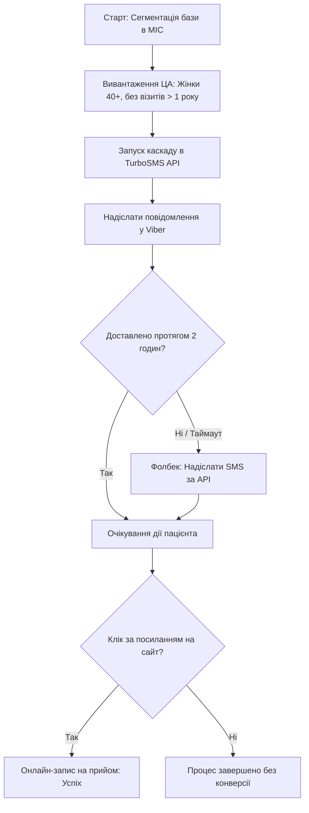

# Кейс: Проєктування каскадних комунікацій у сфері Healthcare (Кейс "Мамографія")

## 📌 Бізнес-контекст та мета проєкту
Медичний центр проводить цільову маркетингову кампанію для залучення пацієнток на профілактичне обстеження. 
* **Цільова аудиторія (ЦА):** Жінки віком від 40 років, які не відвідували клініку більше 1 року.
* **Мета аналітика:** Оптимізувати витрати медичного центру на розсилку сповіщень та автоматизувати запис пацієнтів у медичну інформаційну систему (МІС).

## 🛠️ Специфікація процесу (User Story)
* **Як** Маркетолог медичного центру,
* **Я хочу** автоматично відправляти сповіщення про акцію пацієнтам спочатку через Viber, а у разі відсутності доставки — через SMS,
* **Щоб** знизити витрати клініки на СМС-трафік та автоматично спрямувати пацієнта на сторінку онлайн-запису.

## 📋 Основні кроки сценарію:
1. Система автоматично сегментує базу МІС за заданими фільтрами (Стать, Вік, Дата останнього прийому).
2. Запускається розсилка через API шлюзу (TurboSMS). Повідомлення надходить у Viber (містить інтерактивну кнопку "Записатися").
3. Система очікує статус доставки. Якщо протягом 2 годин статус "Доставлено" не отримано, тригериться фолбек-сценарій.
4. Партнеру відправляється команда на відправку звичайного текстового SMS із коротким посилання на сайт клініки.

## 📊 Схема процесу (Mermaid.js)

## 📈 Бізнес-аналіз: Автоматизований каскад vs Ручний обдзвон реєстраторами
Порівняно з практикою ручного обдзвону пацієнток операторами рецепції, автоматизований каскад продемонстрував такі переваги для медичного бізнесу:
1. **Економіка робочого часу:** Ручний обдзвон створює ілюзію «безкоштовного» каналу, але фактично відволікає реєстраторів від їхніх основних обов'язків — швидкого оформлення пацієнтів на рецепції та обробки вхідного потоку. 
2. **Конверсія 24/7:** Повідомлення у месенджерах містять direct link (пряме посилання). Пацієнтка може перейти в один клік до віджета онлайн-запису в МІС і забронювати слот у будь-який зручний час (наприклад, пізно ввечері), що суттєво підвищує конверсію кампанії.
